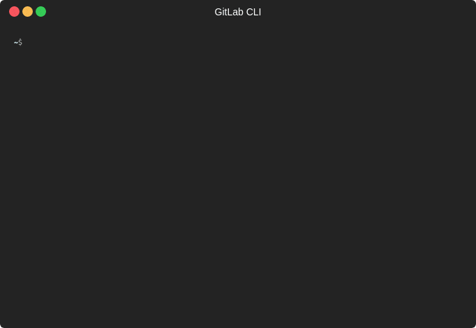

# GitLab Command Line Interface

The GitLab Command Line Interface (CLI) is a cross-platform command line utility
that provides a user-friendly yet powerful way to query information from your
GitLab repos.



## Installation and usage

```
go get github.com/makkes/gitlab-cli
```

or grab the binary of the [most current
release](https://github.com/makkes/gitlab-cli/releases).

All commands of gitlab-cli currently require that you are authenticated. To do
so you issue `gitlab-cli login YOUR_TOKEN YOUR_USERNAME`. You obtain a personal
access token at https://gitlab.com/profile/personal_access_tokens.

## License

This software is distributed under the BSD 2-Clause License, see
[LICENSE](LICENSE) for more information.

